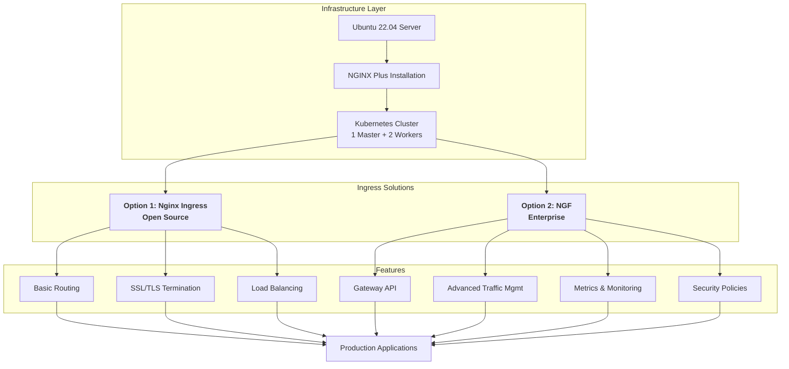
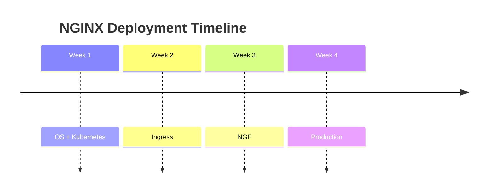

<!--
# 🚀 NGINX Plus & Gateway Fabric Installation Suite

A comprehensive toolkit for deploying and managing **NGINX Plus** and **NGINX Gateway Fabric (NGF)** in production Kubernetes environments.
-->

<div align="center">

# 🚀 NGINX Plus & Gateway Fabric Installation Suite

### *Enterprise-Grade Application Delivery Infrastructure*


*A comprehensive toolkit for deploying and managing **NGINX Plus** and **NGINX Gateway Fabric (NGF)** in production Kubernetes environments.*

</div>

---

## 📊 Quick Navigation

| [🏗️ Architecture](#-architecture-overview) | [📚 Guides](#-documentation-guide) | [⚡ Quick Start](#-quick-start) | [🛠️ Tools](#-tools--technologies) |
|------------------------------------------|-----------------------------------|--------------------------------|-----------------------------------|

---

## 🏗️ Architecture Overview



---

## 📚 Documentation Guide

| Guide                                            | Purpose                             |
| ------------------------------------------------ | ----------------------------------- |
| **Installing_NGINX_Plus_on_Ubuntu.md**           | NGINX Plus installation & licensing |
| **KubernetesClusterInstallationGuide.md**        | 3-Node Kubernetes cluster           |
| **Kubernetes Nginx Ingress Controller Setup.md** | Open-source ingress                 |
| **NGF-Installation-and-Testing.md**              | NGINX Gateway Fabric                |
| **Advanced_NGF-Configuration-Guide.md**          | Enterprise traffic & security       |

---

## 🆚 Solution Comparison Matrix

| Feature      | Nginx Ingress | NGINX Gateway Fabric |
| ------------ | ------------- | -------------------- |
| License      | Open Source   | Commercial           |
| API          | Ingress       | Gateway API          |
| Traffic Mgmt | Basic         | Advanced             |
| Security     | Basic TLS     | Enterprise policies  |
| Best For     | Dev / Test    | Production           |

---

## 🚀 Quick Start

### Option 1: Open Source

```bash
git clone https://github.com/Abdelrhman2371999/NGINX-Plus-Gateway-Fabric-Installation-Suite.git
cd NGINX-Plus-Gateway-Fabric-Installation-Suite
kubectl get all -n ingress-nginx
```

### Option 2: Enterprise

```bash
helm repo add nginx-stable https://helm.nginx.com/stable
helm install nginx-gateway nginx-stable/nginx-gateway-fabric
```

---

## 🛠️ Tools & Technologies

| Component     | Technology   |
| ------------- | ------------ |
| OS            | Ubuntu 22.04 |
| Runtime       | containerd   |
| Orchestration | Kubernetes   |
| Ingress       | NGINX / NGF  |
| Load Balancer | MetalLB      |
| Package Mgmt  | Helm         |

---

## 🔍 Diagnostic Commands

```bash
kubectl get nodes
kubectl get pods -A
kubectl get svc -A
kubectl get gatewayclass
```

---

## 🚨 Troubleshooting

<details>
<summary>Pod Pending</summary>

```bash
kubectl describe pod <pod>
kubectl describe node
```
</details>

<details>
<summary>Connection Refused</summary>

```bash
kubectl get svc -n ingress-nginx
sudo ufw allow <NodePort>/tcp
```
</details>

---

## 📈 Implementation Roadmap



---

## 🤝 Contributing

```bash
git checkout -b feature/improvement
git commit -am "Improve docs"
git push origin feature/improvement
```

---

## 📖 Resources

* NGINX Docs
* Gateway API
* Kubernetes Ingress
* MetalLB

---

<div align="center">

**Maintained by Abdelrhman Hamed**  
Built with ❤️ for Kubernetes & NGINX

</div>
